# 学会使用这13个AI SQL生成软件,五分钟搞定数据库查询

写SQL查询对不懂代码的业务人员来说就是天书,数据分析师每天也要花大量时间调试复杂语句。现在AI SQL生成器把这个门槛彻底打掉了,用大白话描述需求就能自动生成精准的查询代码,支持MySQL、PostgreSQL、MongoDB等几乎所有主流数据库。这些工具不只是生成代码,还能优化慢查询、修复语法错误、解释复杂逻辑,让数据查询效率提升10倍以上。下面整理了13个靠谱的平台,从完全免费到企业级方案都有,5分钟就能上手开始用。

***

## **[SQLAI.ai](https://www.sqlai.ai)**

下一代AI数据智能平台,直连数据库实时执行

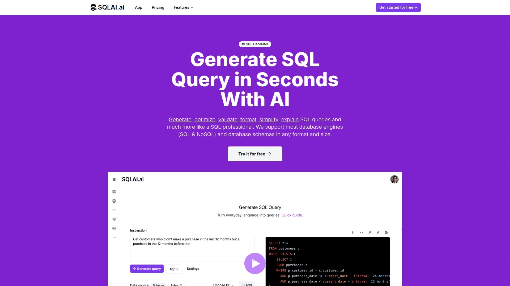

SQLAI.ai是目前功能最全面的AI SQL助手,基于GPT-4模型提供高质量查询生成,被全球超过10万专业人士使用。最大的特点是可以直接连接你的数据库执行AI生成的SQL,不需要复制粘贴到别的工具再跑。

**核心功能覆盖整个工作流**:自然语言生成SQL和NoSQL查询、查询优化建议、语法错误修复和详细解释、格式化代码、简化复杂查询。支持手动添加数据库schema、从CSV导入、从任意格式(JSON/HTML/prisma.schema)导入,甚至能从已连接的数据库自动提取表结构。

**AI数据智能**是杀手级功能:一键连接MySQL、PostgreSQL、SQL Server、Oracle、MongoDB等主流数据库,直接在连接的数据库上运行生成的SQL并可视化结果。数据库凭证采用完全加密存储,不用担心安全问题。

结果是流式输出的,不需要等整个查询执行完就能看到数据,这在处理大数据集时体验好太多。可以保存和分享SQL代码片段,团队协作很方便。支持多语言界面,全球用户都能用母语操作。

定价极具竞争力:月费只要5美元,比ai2sql的17美元、text2sql的7美元、aiquery的10美元都有优势。提供免费版让你先测试功能,满意再升级。

***

## **[AI2sql](https://ai2sql.io)**

5万专业人士在用,支持数据库类型最多

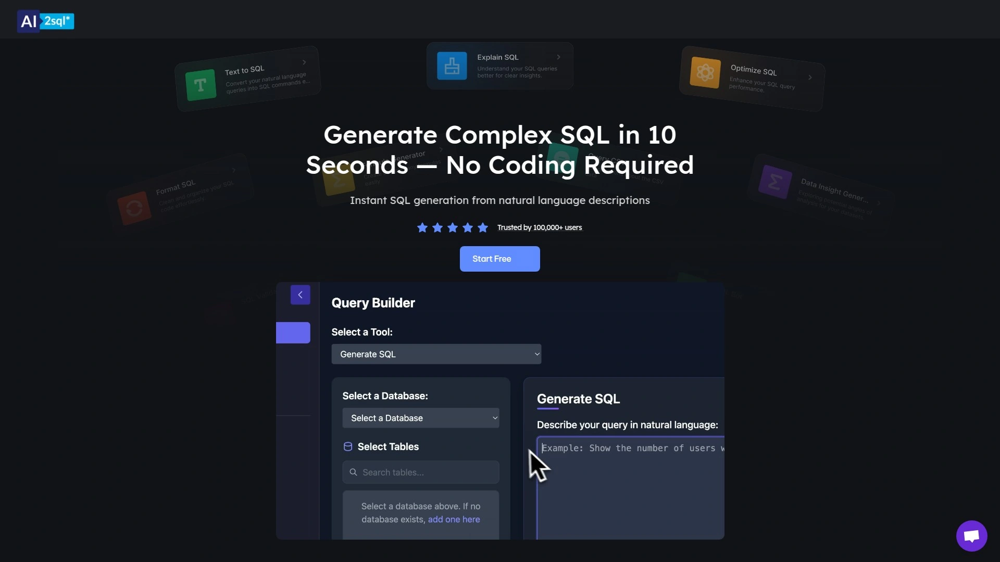

AI2sql是市场上老牌的AI SQL构建器,每周帮用户节省10小时以上的查询编写和调试时间。支持的数据库类型非常全:SQL、MySQL、PostgreSQL、Oracle PL/SQL、MongoDB、BigQuery、MariaDB、Redshift、SnowSQL等。

**三档定价**适合不同需求:Start版$9/月提供100次查询和10张表限制,适合小项目;Pro版$24/月提供300次查询和50张表,增加数据库连接器;Business版$39/月提供1000次查询和无限表,还有API集成和桌面应用。企业版提供定制化训练和私有化部署。

除了SQL生成,还有公式生成器、ER图绘制、SQL文件上传等实用工具。数据库连接器能直接拉取生产环境数据结构,不需要手动复制表定义。

用户反馈说界面对初学者有点复杂,但功能确实强大,尤其是"解释SQL"功能对学习复杂查询逻辑帮助很大。查询优化功能能显著提升性能,在某些案例中查询速度提升了25倍。

7天免费试用让你充分测试是否符合需求,专业版功能都能试。聊天客服响应速度快,遇到问题能及时解决。

***

## **[Text2SQL.ai](https://www.text2sql.ai)**

25.6万用户选择,秒级生成优化查询

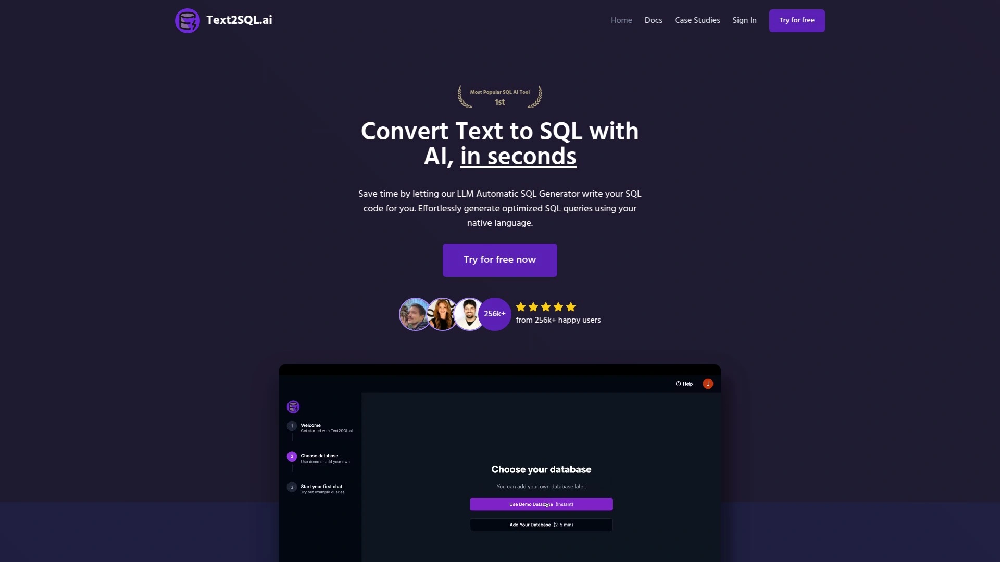

Text2SQL.ai用LLM自动生成器帮你把母语快速转成SQL代码,支持MySQL、PostgreSQL、Oracle等主流数据库。最大优势是速度快且准确率高,大部分请求第一次就能生成正确的SQL。

**个人SQL AI助手**功能很贴心:能回答所有SQL相关问题,秒级给出精准答案,不需要等数据分析师或花几小时研究复杂查询。支持追问直到你满意为止。

**Schema功能**是提升准确度的关键:通过添加数据库表、列和关系,AI能生成完全匹配你数据结构的精准查询,还会针对你的具体设计做优化。生成的代码可以直接使用,不需要手动编辑或修正。

提供公共API让你从任何地方生成SQL查询,可以集成到自己的工具里构建定制化的SQL AI应用。这对SaaS产品或内部BI工具特别有用。

月费7美元在同类工具中价格适中,性价比不错。界面简洁直观,新手5分钟就能上手开始生成查询。

***

## **[EverSQL](https://www.eversql.com)**

专注性能优化,查询平均快25倍

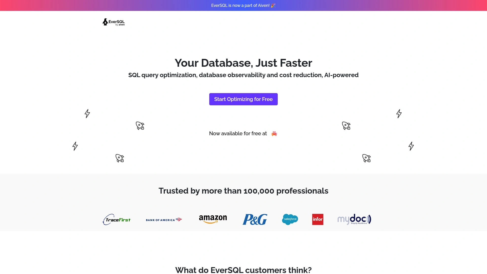

EverSQL不是传统的SQL生成器,而是专业的PostgreSQL和MySQL优化工具,被超过10万工程师使用。客户报告显示查询平均提速25倍,团队每周节省140小时。

**完全非侵入式**:不访问数据库的敏感数据,只分析查询语句结构和执行计划。选择数据库类型和平台,提交需要优化的查询,AI算法会自动重写和索引建议。会详细解释做了什么改动以及为什么这样改。

**性能传感器**持续监控PostgreSQL和MySQL数据库性能,生成易懂易实施的优化建议。能帮你降低数据库月成本,提供删除冗余索引、schema优化等建议,优化性能的同时减少CPU、内存和存储开销。

**ORM优化**是独特卖点:很多框架(TypeORM、Sequelize、Hibernate)自动生成的查询写得很烂不考虑性能,EverSQL能识别最慢的查询并定位缺失的索引,让性能提升10倍。还支持混合模式,优化ORM和原生SQL查询。

实时告警功能会在数据库负载达到临界水平时通知你,及时采取行动避免性能问题影响用户体验。智能算法持续分析性能,快速检测异常。

完全免费试用,GitHub CI/CD集成让优化建议直接出现在pull request检查结果里。适合需要榨干数据库性能的开发团队和DBA。

---

## **[SQLPilot](https://sqlpilot.ai)**

知识库RAG支持,生成质量更准确

SQLPilot的核心差异化是RAG(检索增强生成)支持,把你的知识库连接到LLM生成查询,输出质量明显更好。用自然语言写提示或手动指定表名,选择AI模型就能生成优化的SQL。

**支持主流数据库**:目前完美支持PostgreSQL和MySQL,更多数据库即将推出。可以添加无限数量的数据库连接,适合管理多个项目的团队。

**自带密钥(BYOK)**功能很实用:可以添加自己的OpenAI密钥使用SQLPilot,成本更可控。支持GPT-3.5、GPT-4和GPT-4o多个模型,根据查询复杂度选择合适的模型平衡速度和质量。

**隐私和安全**是重点:不存储你的schema、查询或凭证,只用你提供的数据生成SQL查询。这对处理敏感数据的企业特别重要。

查询结果可以下载为CSV格式,Excel支持即将推出。免费版就能开始使用,不需要信用卡,体验够用后再决定是否升级。

***

## **[Outerbase](https://www.outerbase.com)**

现代化数据库界面,EZQL聊天式查询

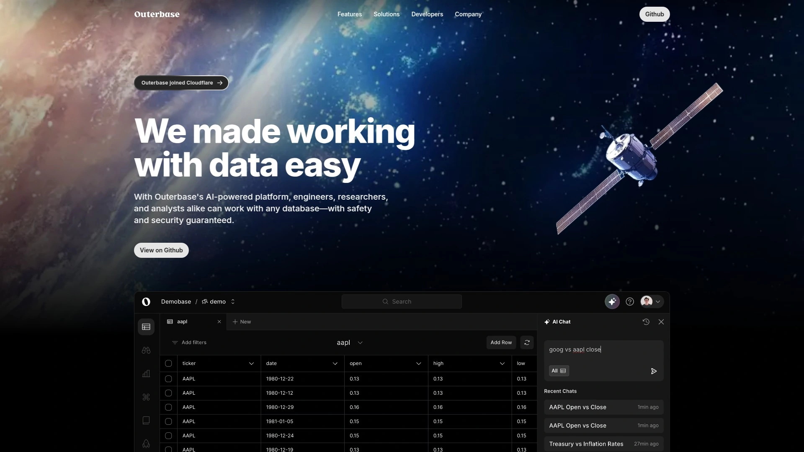

Outerbase是新一代数据库管理工具,把查询、分析、可视化、协作整合在一个云端环境。最特别的是EZQL功能——AI驱动的自然语言转SQL代理,让不懂SQL的人也能直接和数据库对话。

**电子表格式界面**展示数据表,通过插件(或自己开发)可以增强体验适应你的工作方式。团队可以创建中心化的数据协作hub,一起创建保存的查询、可视化仪表板、贡献数据目录。

**一键生成图表**:从任何查询结果可以瞬间填充可定制的图表,能嵌入、导出或保存到仪表板。对需要快速展示数据洞察的场景特别实用。

**Commands功能**(目前beta)让你构建自动化流程,简化日常任务或为独特挑战打造定制方案。还能直接在UI里修改schema,添加表、改字段类型、调整表关系都不需要写DDL语句。

支持LibSQL、SQLite、Cloudflare D1、MySQL、PostgreSQL等多种数据库。桌面应用版本支持浏览器里没法用的驱动。完全开源,可以自己部署或用云端版本。

***

## **[Defog.ai](https://defog.ai)**

SQLCoder开源模型,性能超越GPT-4

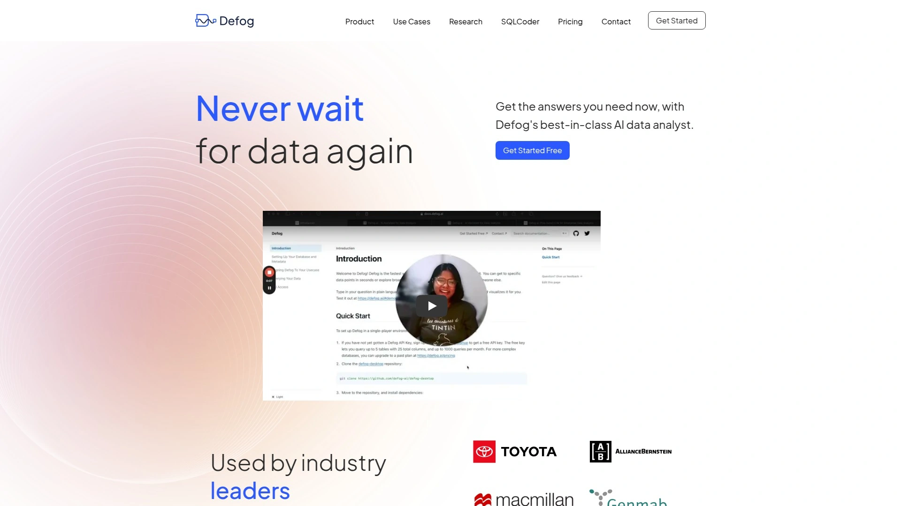

Defog开源了SQLCoder系列大语言模型,在自然语言转SQL任务上超过GPT-4和GPT-4-turbo。模型在sql-eval框架上的表现显著优于所有流行的开源模型。

**三种运行方式**适应不同环境:NVIDIA GPU(16GB以上VRAM)性能最佳,Apple Silicon用量化版本,无GPU的电脑用LLAMA-CPP。安装简单,几行pip命令就搞定。

**企业级微调**是Defog的商业化方向:为企业数据分析提供精调的LLM,确保生成的查询符合公司特定的数据结构和业务逻辑。在sql-eval测试中,SQLCoder达到64.6%的准确率,超过GPT-3.5-turbo的60.6%。

模型权重采用CC BY-SA 4.0许可证,附加OpenRAIL-M负责任使用条款。你可以用于任何目的包括商业,但如果微调模型必须以相同许可证开源修改后的权重。

15B参数的模型性能比10倍大小的text-davinci-003还好,证明了架构和训练数据质量的重要性。可以在HuggingFace和Colab上直接试用交互式demo。

***

## **[Dataherald](https://dataherald.readthedocs.io)**

可嵌入产品的NL-to-SQL API

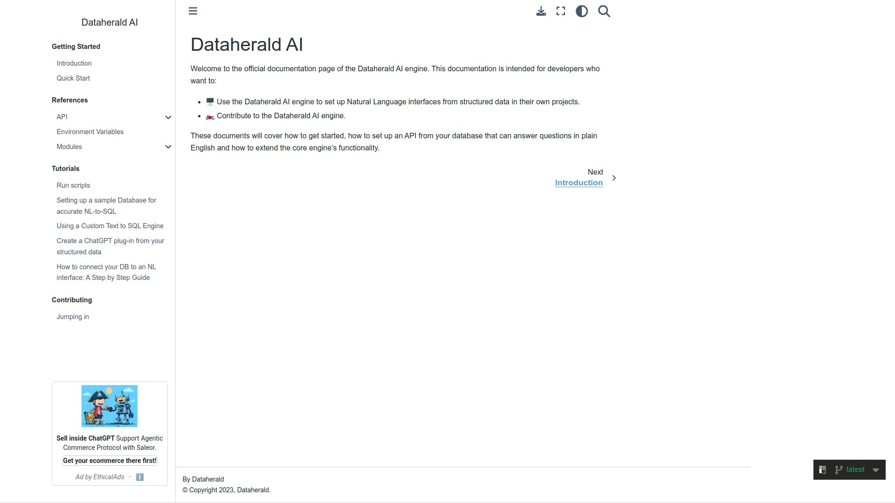

Dataherald让你把自然语言转SQL功能嵌入到自己的产品里,用户可以用母语进行无代码数据分析、拉报表、执行复杂查询。专为开发者打造,解决LLM开箱即用效果不好的问题。

**两种LangChain代理**做NL到SQL转换:RAG-only代理用于没有大量训练数据的场景,靠few-shot prompting工作;高级代理用微调的LLM作为工具,需要每张表至少10个黄金SQL样本。

RAG代理连接数据库提取表结构、分类值、描述等信息,使用schema-linking工具识别相关表列、SQL执行工具验证正确性和从错误中恢复、few-shot样本检索工具获取相似查询用于提示。开发者可以基于相关性注入业务特定指令增强提示。

**一键微调**模型只需要一个API调用,托管版提供UI让你通过代码编辑器修改SQL并添加到训练数据。微调后的模型作为工具部署在agent内,agent负责检索业务上下文。

完全开源可以自己部署,也有托管API版本提供性能监控和配置UI。适合想给产品添加AI数据查询能力的SaaS公司和企业应用开发者。

***

## **[AskYourDatabase](https://www.askyourdatabase.com)**

最佳AI数据分析师和SQL AI聊天机器人

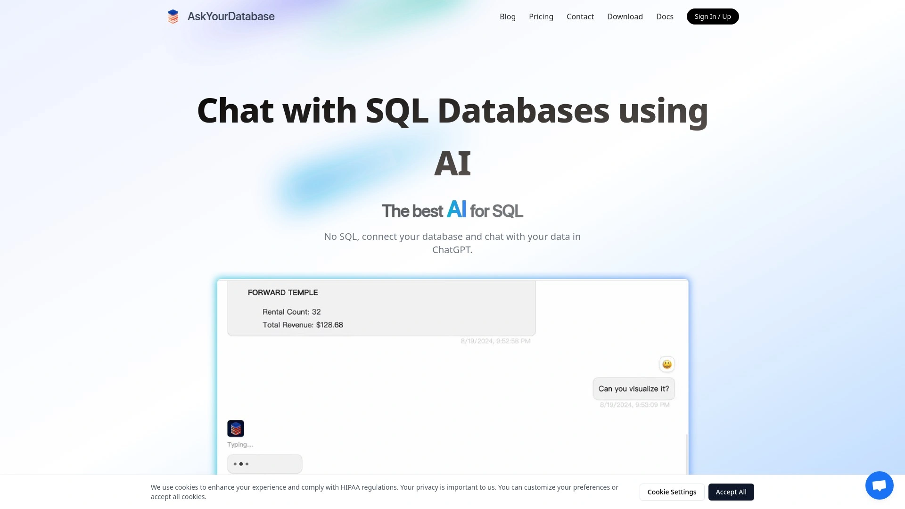

AskYourDatabase把AI数据分析师的能力打包成聊天机器人形式,不需要SQL知识就能和数据库对话。界面设计得像聊天应用,问问题就能得到数据洞察和可视化图表。

支持连接主流数据库,安全性有保障。特别适合产品经理、业务分析师、创业公司创始人这类需要快速获取数据但不想学SQL的人群。

AI能主动推荐你可能关心的问题,不只是被动回答,这种探索式分析对发现数据里的隐藏模式很有用。还能记住对话上下文,追问和澄清问题体验很自然。

定价模式是订阅制,根据查询量和用户数分档。适合把数据分析民主化、让所有团队成员都能自助获取洞察的公司。

***

## **[BlazeSQL](https://www.blazesql.com)**

秒级完成数据分析工作的AI助手

BlazeSQL宣称"这个AI数据分析师在几秒内完成你的工作"。专注于速度和易用性,界面极简,输入问题马上得到SQL查询和执行结果。

自动选择合适的可视化方式,不需要手动配置图表类型和参数。对需要快速做临时分析、生成报告的场景特别实用。

支持团队协作,可以分享查询和仪表板给同事。定价透明,有免费试用额度让你先体验实际效果。

适合快节奏工作环境,数据分析需求频繁但单个查询不复杂的团队。

***

## **[Channel AI](https://channel.ai)**

Slack集成的自助数据洞察工具

Channel让你在Slack里直接用自然语言查询数据仓库,把数据分析无缝集成到日常工作流。不需要跳转到专门的BI平台,在聊天窗口就能获取数据。

**主动洞察**是亮点:不只是回答问题,还会基于历史查询主动推送你可能关心的洞察。共享定义功能确保整个组织对数据指标的理解一致,避免各说各话。

支持Snowflake、MySQL等各种数据仓库,用行业标准加密保护数据集成。采用freemium模式,免费版能体验核心功能,付费版解锁高级特性。

特别适合远程团队和习惯在Slack沟通的公司,数据分析能直接在工作流里完成不需要切换工具。

***

## **[Graphite Note AI SQL Builder](https://graphite-note.com/free-ai-tools/ai-sql-builder/)**

完全免费的SQL生成器,无需注册

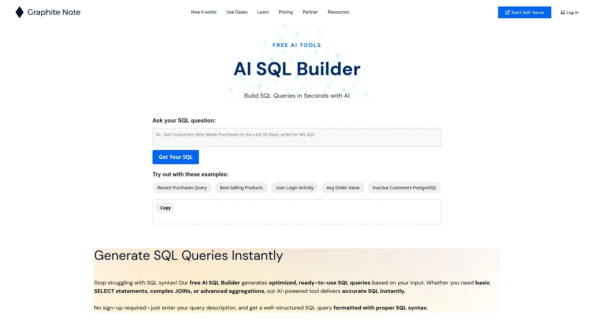

Graphite Note提供的免费AI SQL构建器能生成优化的即用型SQL查询。支持基础SELECT语句、复杂JOIN、高级聚合等各种查询模式。

**最大优势是完全免费**:不需要注册登录,直接输入查询描述就能得到格式规范、语法正确的SQL。对学生、初创公司、偶尔需要写SQL的人特别友好。

查询质量不错,生成的代码结构清晰易读。虽然没有付费工具那么多高级功能,但应付日常基础查询完全够用。

适合预算为零、只需要简单SQL生成功能的用户。

***

## **[ZZZCode AI SQL Generator](https://zzzcode.ai/sql/query-generator)**

在线快速生成各类SQL语句

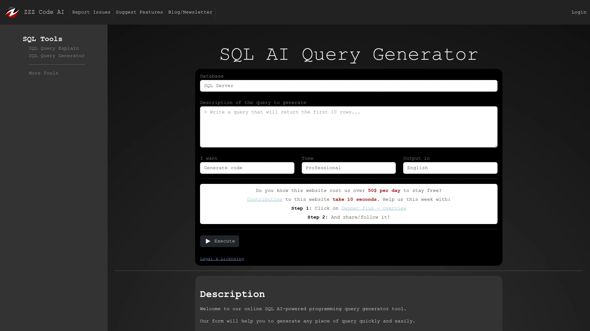

ZZZCode的在线表单式SQL生成器操作简单直接,选择查询类型、填写参数就能快速生成代码。支持生成各种SQL片段,不只是完整查询。

界面友好,新手也能快速上手。生成速度快,适合需要快速原型验证或学习SQL语法的场景。

完全免费使用,不需要创建账号。虽然功能没有企业级工具丰富,但对个人开发者和学习者来说够用。

***

## **[SQL Translator (开源)](https://github.com/whoiskatrin/sql-translator)**

SQL和自然语言双向翻译开源工具

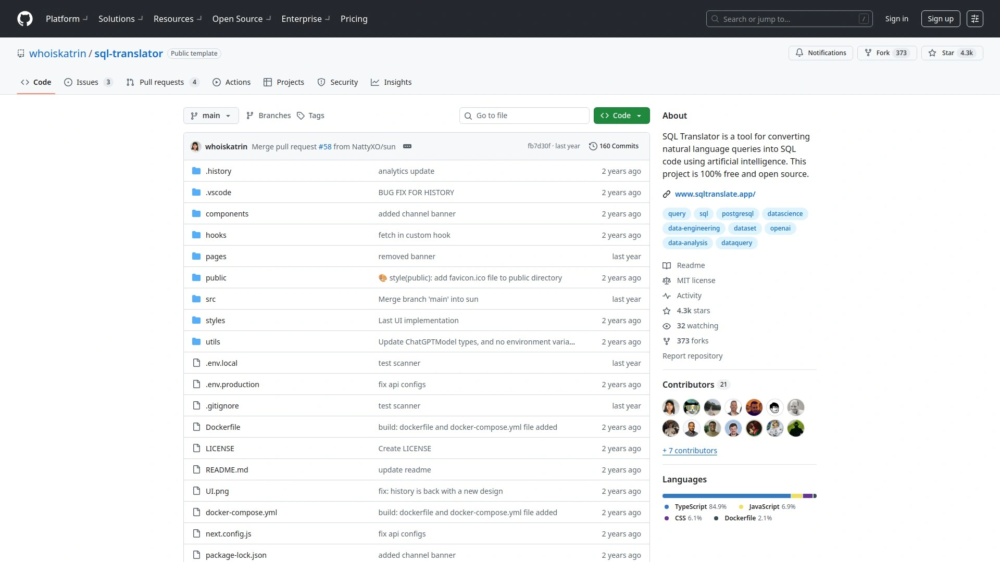

SQL Translator是100%免费开源的双向翻译工具,既能把自然语言转成SQL,也能把SQL翻译成人类可读的语言。对理解别人写的复杂查询特别有用。

**功能特性**包括:深色模式、大小写切换、一键复制、SQL语法高亮、schema感知(beta)、查询历史记录。操作很简单,输入查询点翻译按钮就能看到结果,按反向按钮可以切换输入输出类型。

完全开源意味着你可以自己部署、修改代码、集成到自己的工具里。代码托管在GitHub,社区活跃,遇到问题可以提issue。

适合喜欢开源工具、有一定技术能力、想要完全控制数据隐私的开发者。

***

## 常见问题

**AI生成的SQL查询准确率有多高?**

准确率主要取决于三个因素:AI模型质量、数据库schema信息完整度、问题描述的清晰度。顶级工具像SQLAI.ai和Defog的SQLCoder在标准测试集上准确率超过60%,某些场景可以达到75%以上。提供详细的表结构、列描述、表关系能显著提升准确率。Text2SQL.ai的用户反馈说大部分请求第一次就生成正确的SQL。即使第一次不完美,这些工具都支持追问和调整,几轮对话后基本都能得到想要的结果。建议生成后先在测试环境验证再用于生产。

**这些工具会把我的数据库信息泄露给AI公司吗?**

靠谱的工具都会明确说明隐私政策。SQLPilot明确表示不存储schema、查询或凭证,只用你提供的数据生成查询。EverSQL是完全非侵入式的,不访问数据库敏感数据。SQLAI.ai的数据库凭证采用完全加密存储。如果特别敏感,可以选择开源方案自己部署,比如SQL Translator或Dataherald。或者只提供表结构而不连接真实数据库,在本地环境执行生成的SQL。企业用户还可以选择支持私有化部署的方案,所有数据都在自己服务器上处理。

**免费版和付费版的核心区别是什么?**

主要差别在查询次数限制、支持的数据库类型、高级功能访问。AI2sql的Start版月费$9提供100次查询,Pro版$24提供300次,Business版$39提供1000次。免费版通常只支持基础数据库(MySQL/PostgreSQL),付费版才有Oracle、MongoDB、Snowflake等。高级功能如数据库连接器、API集成、团队协作、优先客服大多需要付费。SQLAI.ai的$5月费在同类中最便宜,性价比高。如果只是偶尔用或学习目的,Graphite Note和ZZZCode的完全免费版就够用。对需要频繁生成复杂查询的专业团队,付费版的投资回报率很高,毕竟每周能节省10小时以上。

---

## 写在最后

SQL查询这道坎,AI已经帮你跨过去了。这13个工具覆盖了从免费入门到企业级部署的各种需求,核心都是让数据查询变简单。如果要推荐一个综合实力最强的,[SQLAI.ai](https://www.sqlai.ai)是最明智的选择——它不只是生成SQL,还能直连数据库实时执行、流式输出结果、自动优化慢查询,关键是月费只要5美元却提供比竞品更多的功能。支持所有主流数据库类型,数据安全有完整加密保障,10万专业用户的选择证明了它的可靠性。预算紧张就用Graphite Note或ZZZCode免费版,需要嵌入产品选Dataherald,追求开源隐私用SQL Translator,专注性能优化找EverSQL。别再花几小时调试复杂查询了,5分钟让AI帮你搞定,把时间投到真正创造价值的数据分析和业务决策上才是正道。
